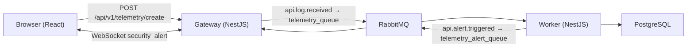

# Sentinel Watch

A full-stack telemetry audit demo: ingest API request metrics, persist them, detect security-relevant alerts, and push real-time notifications to a React dashboard.

Built as a senior full-stack engineering checkpoint — microservices, message queues, WebSockets, and containerized deployment.

## What it does

1. The **client** simulates API telemetry events (success or alert-triggering).
2. The **gateway** accepts HTTP requests and publishes events to RabbitMQ.
3. The **worker** consumes telemetry, stores records in PostgreSQL, and publishes alerts when rules match.
4. The **gateway** receives alerts over RabbitMQ and broadcasts them to the browser via Socket.IO.

### Alert rules

A request is flagged as an alert when:

- `statusCode >= 400`, or
- `responseTimeMs > 2000`

## Architecture



| Service   | Role                                      | Port (host) |
|-----------|-------------------------------------------|-------------|
| client    | React UI + telemetry simulation           | 5173        |
| gateway   | REST API, RabbitMQ client/consumer, WS    | 3000        |
| worker    | RabbitMQ consumer, persistence, alerts    | —           |
| db        | PostgreSQL                                | 5432        |
| rabbitmq  | Message broker (+ management UI)          | 5672, 15672 |

## Tech stack

| Layer      | Technologies |
|------------|--------------|
| Frontend   | React, Vite, TypeScript, Socket.IO client |
| Gateway    | NestJS, Socket.IO, RabbitMQ, class-validator |
| Worker     | NestJS, TypeORM, PostgreSQL, RabbitMQ |
| Infra      | Docker, Docker Compose, RabbitMQ, PostgreSQL 18 |

## Project structure

```text
sentinelwatch/
├── client/          # React frontend
├── gateway/         # HTTP API + WebSocket + RabbitMQ
├── worker/          # Telemetry processing + DB persistence
└── infra/           # docker-compose.yml
```

## Prerequisites

- [Docker Desktop](https://www.docker.com/products/docker-desktop/) (recommended)
- Or, for local development: Node.js 22+, PostgreSQL, RabbitMQ

## Run with Docker (recommended)

From the `infra` directory:

```bash
cd infra
docker compose up --build
```

First run pulls images and builds services — it may take a few minutes.

| URL | Purpose |
|-----|---------|
| http://localhost:5173 | Frontend |
| http://localhost:3000 | Gateway API |
| http://localhost:15672 | RabbitMQ management (guest / guest) |

### Using the app

1. Open http://localhost:5173
2. Confirm **WebSocket: connected**
3. Click **Simulate Successful Request** — telemetry is stored (no alert)
4. Click **Simulate Alert Request** — alert JSON appears in the dashboard via WebSocket

### Stop

```bash
docker compose down
```

Reset the database volume:

```bash
docker compose down -v
```

## Run locally (without Docker)

Run PostgreSQL and RabbitMQ separately, then configure each service from its `.env` file (see `.env.example` in each package).

**Terminal 1 — worker**

```bash
cd worker
cp .env.example .env   # edit if needed
npm install
npm run start:dev
```

**Terminal 2 — gateway**

```bash
cd gateway
cp .env.example .env
npm install
npm run start:dev
```

**Terminal 3 — client**

```bash
cd client
cp .env.example .env
npm install
npm run dev
```

Open http://localhost:5173

## Environment variables

### Gateway (`gateway/.env`)

| Variable | Description | Example |
|----------|-------------|---------|
| `PORT` | HTTP port | `3000` |
| `FRONTEND_URL` | CORS origin (browser URL) | `http://localhost:5173` |
| `RABBITMQ_URL` | Broker URL | `amqp://localhost:5672` |
| `RABBITMQ_TELEMETRY_QUEUE` | Queue for log events | `telemetry_queue` |
| `RABBITMQ_TELEMETRY_ALERT_QUEUE` | Queue for alert events | `telemetry_alert_queue` |

### Worker (`worker/.env`)

| Variable | Description | Example |
|----------|-------------|---------|
| `DB_HOST` | Postgres host | `localhost` |
| `DB_PORT` | Postgres port | `5432` |
| `DB_USER` | Postgres user | `postgres` |
| `DB_PASSWORD` | Postgres password | — |
| `DB_NAME` | Database name | `sentinelwatch` |
| `RABBITMQ_URL` | Broker URL | `amqp://localhost:5672` |
| `RABBITMQ_TELEMETRY_QUEUE` | Consumer queue | `telemetry_queue` |
| `RABBITMQ_TELEMETRY_ALERT_QUEUE` | Alert publish queue | `telemetry_alert_queue` |

### Client (`client/.env`)

| Variable | Description | Example |
|----------|-------------|---------|
| `VITE_BACKEND_URL` | Gateway base URL (browser) | `http://localhost:3000` |
| `VITE_BACKEND_API_ROUTE` | API prefix | `api/v1` |

> In Docker Compose, service-to-service URLs use container names (`db`, `rabbitmq`). Browser-facing URLs use `localhost`.

## API

**POST** `/api/v1/telemetry/create`

```json
{
  "path": "/api/v1/users",
  "method": "GET",
  "ip": "192.168.1.1",
  "statusCode": 200,
  "responseTimeMs": 150
}
```

Response: `{ "message": "Request sent" }`

## License

MIT
